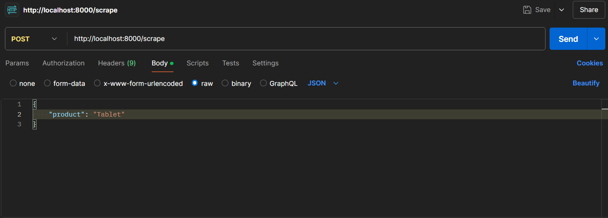
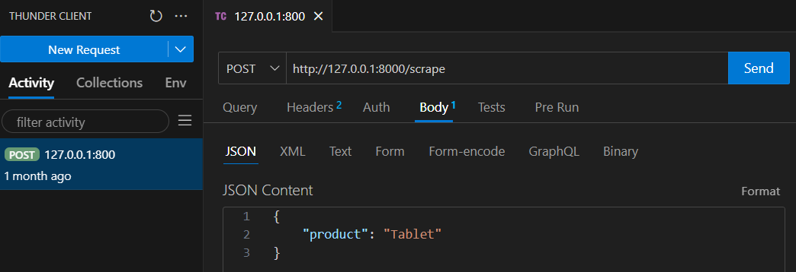

[](https://www.python.org/)
[](https://fastapi.tiangolo.com/)
[](https://docs.python.org/3/library/asyncio.html)
[](https://www.crummy.com/software/BeautifulSoup/)
[](https://pypi.org/project/requests-html/)
[](https://www.mongodb.com/)
[](https://www.postman.com/)
[](https://www.thunderclient.com/)
[](https://www.docker.com/)

# Dockerized Online Store Web Scraper API

This project aims to create an Asynchronous Web Scraper of an Online Store (Mercado Libre), this scraper made just with Python, Beautiful Soup, Request HTML, asyncio, and accesible by using an API created with FastAPI and PyMongo. The data collected is saved into a NoSQL Database from MongoDB and all this project inside a Dockerized Enviroment.

## Index

- [Content Overview](#content-overview)
- [Installation](#installation)
- [Usage](#usage)
- [Specifics API Endpoints scrape and manual](#specifics-api-endpoints-scrape-and-manual)
- [Expectations for future (PowerBI and Tableau Analysis)](#expectations-for-future-powerbi-and-tableau-analysis)
- [Contributions](#contributions)
- [Credits](#credits)
- [License](#license)

## Content Overview

### 1. `app.py`

The Python code that serves as the API with `FastAPI` exposing the needed endpoints. It includes two routes for differents methods of scraping data and additional endpoints to looking at the raw results, and another one with some predefined featured insights from the raw data.

### 2. `scraper.py`

An asynchronous web scraper implemented in Python using `Asyncio`, `Requests_html` and `BeautifulSoup`. It works by passing it the name of the product desired, it makes a search into the Online Store's Web page and extracts the urls of all the products results, then it uses the collected urls and scrapes all the information of the products for each single url.

### 3. `db/ client.py`

The Python code that serves the Instance of the MongoDB connection by using `PyMongo`. NOTE: Technically is more easy to implement the instance of the connection in the other scripts because they also have to call this script to use the connection, but anyway using this like scripts structure is a better practice.

### 4. `requirements.txt`

Contains the required Python dependencies for the project, ensuring a consistent environment for the Dockerfiles to use.

### 5. `Dockerfile`

Configures the Docker image for the API by setting up the working directory, copying the necessary files, and installing dependencies. Then it exposes port 8000 and specifies the command to run the FastAPI Python Script.

### 6. `docker-compose.yml`

Defines the Docker services, specifying the build context, the drivers for the connection between services, port binding, the MongoDB Database, and volume mapping. Additionally, it sets the API environment variable.

## Installation

1. Clone the repository:

    ```bash
    git clone -b master git@github.com:MDavidHernandezP/OnlineStoreWebScraperAPI.git
    cd "the proyect directory"
    ```
    
    OR:

    ```bash
    git clone https://github.com/MDavidHernandezP/OnlineStoreWebScraperAPI.git
    cd "the proyect directory"
    ```

2. Build and run the Docker containers:

    ```bash
    docker-compose up --build
    ```

## Usage

After succesfully have cloned the repository, and have built and run the docker compose file, you can check if the API is working by different ways:

- First, using a web browser to acces the localhost with the respective port, copy and paste this url in your web browser's search bar `http://localhost:8000`.

- Second, using an API visualization or management tool, such as [Postman](https://www.postman.com/downloads/), or you can also use an extension for Visual Studio Code called [Thunder Client](https://www.thunderclient.com/), both works basically the same. In both tools, you will see a search bar with a HTTP Method beside, in the search bar copy and paste the localhost with the correct port like `http://localhost:8000`, then make sure that the HTTP Method is set to `GET`.

## Specifics API Endpoints scrape and manual

Within the routes of the API there are two that can accomplish the task of scraping, `/manual/{product}` and `/scrape`, the first works by just writing the desired product in the URL, but the second one works by passing it the product in a json by using a more specific request method of the API; so maybe it could not be clear how to use it, and here I'm showing how exactly must be used.

- **Endpoint:** `/scrape`

- **Method:** POST

In the section for HTTP Methods beside the search bar, make sure that this method is selected because this specific route won't work if not.

- **Mean of the request:** Body

Using both [Postman](https://www.postman.com/downloads/) or [Thunder Client](https://www.thunderclient.com/), or even another tool to make request to an API, below the search bar from these ones, it must be some options with different kinds of options, you must select the one that says `Body`.

- **Request Format:** JSON

As we say it must be a option bar, but also below this one it must be another one with other differente options, in this case you must select the one that says `json` then in the blank space you must write the name of the product desired with the format below.


    ```json
    {
        "url": "https://www.mercadolibre.com.mx/tu-producto"
    }
    ```

Image of how it looks in Postman.



Image of how it looks in Thunder Client.



- **Response Format:**
Then it should return something similar like this:

    ```json
    {
        "message": "Scrape data by passing a json to the body of the post request.",
        "Your product selected was": "product_json",
        "message": "You could seen the data scraped of your product in the route (/data)."
    }
    ```

You could check the results of the scraper in the respective routes.

## Expectations for future (PowerBI and Tableau Analysis)

The next step that we want to accomplish is using the Data Analyis to get some insights from the Data Collected, this by using Visualization tools such as PowerBI and Tableau; actually we have dived a little bit into using PowerBI connecting MongoDB directly to PowerBI, this to use directly the data in PowerBI to make visualizations and finally create a big Dashboard or even create a Report of the Data using the PowerBI Report Builder, but as I said we have dived just a little bit into this, and aparte this wasn't planned originally for the project, we are just doing this to learn and gain good experience with these tools.

## Contributions

Any contribution is accepted for this project we align with the MIT License for open source. If you are interested in contributing directly with us or just copy our code for an own project you're completly free to do it. You can contact by this email in case of doubts or contributions: `mdavidhernandezp@gmail.com`.

- **Steps for contributing:**
1. Fork the project.
2. Create a branch (`git checkout -b feature/new-feature`).
3. Commit your changes (`git commit -am 'adding new feature'`).
4. Push the branch (`git push origin feature/new-feature`).
5. Open a pull request.


## Credits

This project was originally created by a group team of Data Engineering Students for the subject Database Management.

1. MARIO DAVID HERNÁNDEZ PANTOJA
2. GERARDO HERNÁNDEZ WIDMAN
3. SERGIO JOHANAN BARRERA CHAN
4. JANETH GUADALUPE VALDIVIA PEREZ
5. ESTHER GUADALUPE APAZA HACHO

Then it was reinvented for its improvement and is being mantained by:

1. MARIO DAVID HERNÁNDEZ PANTOJA

## License

This project is licensed under the MIT License

MIT License

Copyright (c) 2024 Mario David Hernández Pantoja

Permission is hereby granted, free of charge, to any person obtaining a copy
of this software and associated documentation files (the "Software"), to deal
in the Software without restriction, including without limitation the rights
to use, copy, modify, merge, publish, distribute, sublicense, and/or sell
copies of the Software, and to permit persons to whom the Software is
furnished to do so, subject to the following conditions:

The above copyright notice and this permission notice shall be included in all
copies or substantial portions of the Software.

THE SOFTWARE IS PROVIDED "AS IS", WITHOUT WARRANTY OF ANY KIND, EXPRESS OR
IMPLIED, INCLUDING BUT NOT LIMITED TO THE WARRANTIES OF MERCHANTABILITY,
FITNESS FOR A PARTICULAR PURPOSE AND NONINFRINGEMENT. IN NO EVENT SHALL THE
AUTHORS OR COPYRIGHT HOLDERS BE LIABLE FOR ANY CLAIM, DAMAGES OR OTHER
LIABILITY, WHETHER IN AN ACTION OF CONTRACT, TORT OR OTHERWISE, ARISING FROM,
OUT OF OR IN CONNECTION WITH THE SOFTWARE OR THE USE OR OTHER DEALINGS IN THE
SOFTWARE.

---